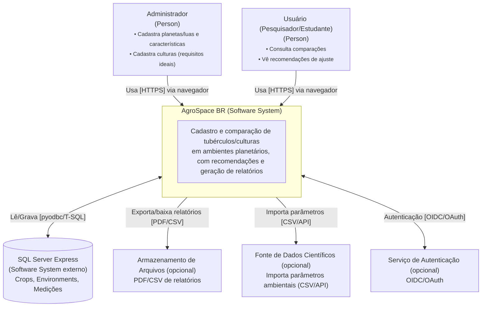

# Arquitetura — AgroSpace BR

## 1) Visão de alto nível
- **Frontend (estático):** `index.html` + `web/app.js` (usa `fetch` para chamar a API).
- **Backend (Flask/Python):** expõe endpoints REST; conecta no **SQL Server** via `pyodbc`.
- **Banco de Dados:** SQL Server Express (10GB), tabelas **Crops** e **Environments** (seeds).

- **OBS:** O simulador é educacional. Cultivos fora da Terra exigem infraestrutura (pressão, temperatura, radiação, água, nutrientes). Os resultados são explicativos, não prescritivos.

## 2) Tecnologias
- **Python 3.11+, Flask 3, flask-cors, pyodbc, python-dotenv**.
- **SQL Server Express** (local) + **ODBC Driver 17/18**.
- HTML/JS puro no front (sem framework, por simplicidade do MVP).

## 3) Endpoints (MVP)
- `GET /health` → status.
- `GET /crops` / `POST /crops`
- `GET /environments` / `POST /environments`
- `POST /match` → `{ score, limiting_factors[], rationale[] }`

## 4) Fluxo principal (sequência do simulador)
1. Front carrega listas de **plantas** e **ambientes** (`GET /crops`, `GET /environments`).
2. Usuário escolhe 1 planta + 1 ambiente e opções de **infra**.
3. Front envia `POST /match`.
4. Backend lê planta/ambiente no DB, calcula `score` e devolve **explicações**.
5. Front exibe **score**, **fatores** e **rationale**.

## 5) Modelo de dados (resumo)
**Crops**
- `Id (PK)`, `CommonName`, `ScientificName?`, `Category`,
- `TempMinC`, `TempMaxC`, `PhMin`, `PhMax`,
- `PhotoperiodMinH?`, `PhotoperiodMaxH?`,
- `WaterNeed (baixa|media|alta)`, `EvidenceLevel`, `Sources?`.

**Environments**
- `Id (PK)`, `Name`, `Type (Terra|Analogico|Planetario)`,
- `TempMinC`, `TempMaxC`, `PressureKPa?`, `GravityG?`, `RadiationIndex?`,
- `SoilPh?`, `SoilType?`, `WaterAvailability? (baixa|media|alta)`,
- `PhotoperiodH?`, `Atmosphere?`, `EvidenceLevel`, `Notes?`, `Sources?`.

*(Os arquivos `api/models/schema.sql` e `seed.sql` criam os objetos e exemplos.)*


O backend lê com `python-dotenv` (`api/config.py`).

## 6) Tratamento de erros e CORS
- **CORS** habilitado no Flask (`flask-cors`) para permitir que o HTML/JS local consuma a API.
- Respostas de erro **JSON**: `{ "error": "mensagem" }` para 400/404/500.

## 7) Desempenho e qualidade (MVP)
- `GET` principais com **P95 < 500 ms** localmente (dados seed).
- Logs simples para erros no backend (stdout).
- Estrutura modular: `api/routers/*`, `api/models/*`, `web/`.

## 8) Como rodar (local)
```bash
# Windows PowerShell
cd C:\Users\...\AgroSpace-br
python -m venv .venv
.venv\Scripts\activate
pip install -r api/requirements.txt

# Criar DB e rodar schema/seed (via SSMS ou scripts)
# Depois:
set FLASK_APP=api.app
bash
flask run --debug
```


## C4-1: Contexto




