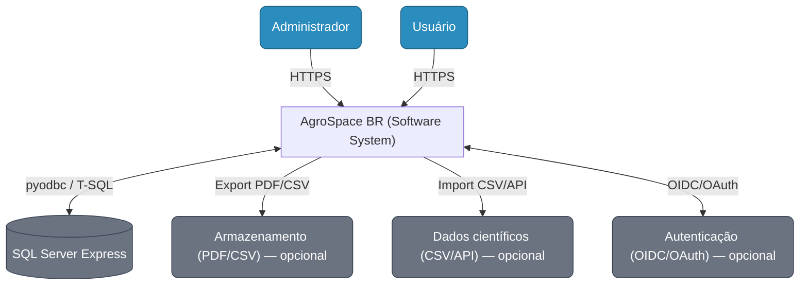
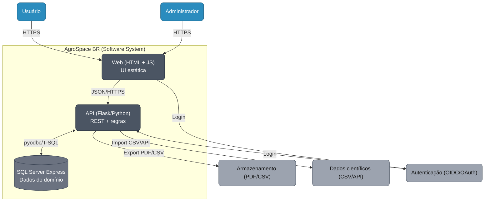
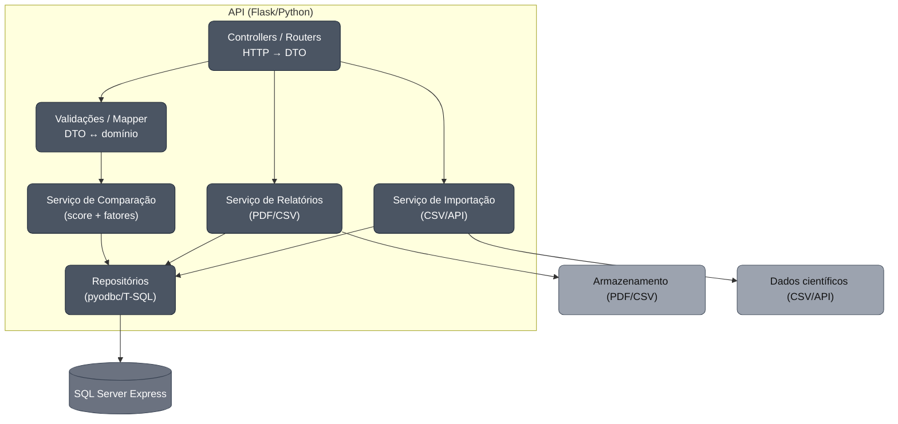

# Arquitetura — AgroSpace BR

## 1) Visão de alto nível
- **Frontend (estático):** `index.html` + `web/app.js` (usa `fetch` para chamar a API).
- **Backend (Flask/Python):** expõe endpoints REST; conecta no **SQL Server** via `pyodbc`.
- **Banco de Dados:** SQL Server Express (10GB), tabelas **Crops** e **Environments** (seeds).

- **OBS:** O simulador é educacional. Cultivos fora da Terra exigem infraestrutura (pressão, temperatura, radiação, água, nutrientes). Os resultados são explicativos, não prescritivos.

## 2) Tecnologias
- **Python 3.11+, Flask 3, flask-cors, pyodbc, python-dotenv**.
- **SQL Server Express** (local) + **ODBC Driver 17/18**.
- HTML/JS puro no front (sem framework, por simplicidade do MVP).

## 3) Endpoints (MVP)
- `GET /health` → status.
- `GET /crops` / `POST /crops`
- `GET /environments` / `POST /environments`
- `POST /match` → `{ score, limiting_factors[], rationale[] }`

## 4) Fluxo principal (sequência do simulador)
1. Front carrega listas de **plantas** e **ambientes** (`GET /crops`, `GET /environments`).
2. Usuário escolhe 1 planta + 1 ambiente e opções de **infra**.
3. Front envia `POST /match`.
4. Backend lê planta/ambiente no DB, calcula `score` e devolve **explicações**.
5. Front exibe **score**, **fatores** e **rationale**.

## 5) Modelo de dados (resumo)
**Crops**
- `Id (PK)`, `CommonName`, `ScientificName?`, `Category`,
- `TempMinC`, `TempMaxC`, `PhMin`, `PhMax`,
- `PhotoperiodMinH?`, `PhotoperiodMaxH?`,
- `WaterNeed (baixa|media|alta)`, `EvidenceLevel`, `Sources?`.

**Environments**
- `Id (PK)`, `Name`, `Type (Terra|Analogico|Planetario)`,
- `TempMinC`, `TempMaxC`, `PressureKPa?`, `GravityG?`, `RadiationIndex?`,
- `SoilPh?`, `SoilType?`, `WaterAvailability? (baixa|media|alta)`,
- `PhotoperiodH?`, `Atmosphere?`, `EvidenceLevel`, `Notes?`, `Sources?`.

*(Os arquivos `api/models/schema.sql` e `seed.sql` criam os objetos e exemplos.)*


O backend lê com `python-dotenv` (`api/config.py`).

## 6) Tratamento de erros e CORS
- **CORS** habilitado no Flask (`flask-cors`) para permitir que o HTML/JS local consuma a API.
- Respostas de erro **JSON**: `{ "error": "mensagem" }` para 400/404/500.

## 7) Desempenho e qualidade (MVP)
- `GET` principais com **P95 < 500 ms** localmente (dados seed).
- Logs simples para erros no backend (stdout).
- Estrutura modular: `api/routers/*`, `api/models/*`, `web/`.

## 8) Como rodar (local)
```bash
# Windows PowerShell
cd C:\Users\...\AgroSpace-br
python -m venv .venv
.venv\Scripts\activate
pip install -r api/requirements.txt

# Criar DB e rodar schema/seed (via SSMS ou scripts)
# Depois:
set FLASK_APP=api.app
bash
flask run --debug
```


## C4-1: Contexto



### C4-1 • Explicação dos elementos

#### Pessoas
- **Administrador** — cadastra **planetas/luas** (características ambientais) e **culturas** (requisitos ideais de solo/água/luz/nutrientes). Pode disparar **exportação de relatórios**.
- **Usuário (pesquisador/estudante)** — consulta as **comparações** entre cultura × ambiente e visualiza **recomendações** de ajustes (solo/atmosfera/infra) para viabilizar o cultivo.

#### Sistema alvo
- **AgroSpace BR (Software System)** — orquestra o **cadastro de dados**, executa o **cálculo de compatibilidade** (score e fatores limitantes) e disponibiliza resultados para **visualização** e **download de relatórios**.  
  *Obs.: a divisão interna em Web/API/BD aparece no C4-2.*

#### Sistemas externos
- **SQL Server Express** — persistência relacional das entidades (*Crops*, *Environments*, *Medições/Seeds*). Acesso via **pyodbc/T-SQL**.
- **Armazenamento de arquivos (opcional)** — destino para arquivos **PDF/CSV** gerados (relatórios e exportações).
- **Fonte de dados científicos (opcional)** — importação de parâmetros ambientais a partir de **CSV/API** (ex.: datasets públicos).
- **Serviço de autenticação (opcional)** — provedor **OIDC/OAuth** caso seja necessário login.

#### Relações (significado das setas)
- **Administrador/Usuário → AgroSpace BR**: uso via navegador (**HTTPS**).
- **AgroSpace BR ↔ SQL Server Express**: leitura/gravação de dados (**pyodbc/T-SQL**).
- **AgroSpace BR → Armazenamento**: exportação de **relatórios (PDF/CSV)**.
- **AgroSpace BR → Fonte científica**: **importação** de parâmetros (**CSV/API**).
- **AgroSpace BR ↔ Autenticação**: **login** e verificação de identidade (quando ativado).


### C4-2 • Contêineres




### C4-2 • Explicação dos Contêineres

**Visão geral**  
O AgroSpace BR é dividido em três contêineres principais (Web, API e Banco) e integra alguns serviços externos opcionais.

#### Contêineres internos

| Contêiner | Responsabilidades | Tecnologias | Comunicação |
|---|---|---|---|
| **Web (HTML + JS)** | Entregar páginas estáticas; coletar entradas do usuário; chamar a API via `fetch`; iniciar downloads de relatórios. | HTML, CSS, JavaScript (puro) | → API: **HTTPS/JSON** |
| **API (Flask/Python)** | Expor endpoints REST; validar dados; executar **comparação (score/fatores)**; **gerar relatórios (PDF/CSV)**; orquestrar importações. | Python 3.11+, Flask, flask-cors, python-dotenv, **pyodbc** | ↔ DB: **pyodbc/T-SQL**; → Armazenamento: **arquivo**; → Dados científicos: **CSV/API** |
| **Banco de Dados** | Persistir domínios: *Crops*, *Environments*, *Medições* (seeds). | **SQL Server Express** | ↔ API: **pyodbc/T-SQL** |

#### Sistemas externos (quando usados)

| Sistema externo | Uso no sistema | Observações |
|---|---|---|
| **Armazenamento (PDF/CSV)** | Guardar relatórios gerados para **download**. | Pode ser diretório local do servidor na TP3. |
| **Dados científicos (CSV/API)** | **Importar** parâmetros ambientais públicos. | Planilhas/CSV ou endpoint público. |
| **Autenticação (OIDC/OAuth)** | Login do usuário/adm. | Pode entrar em sprint futura. |

**Relações (setas do diagrama)**  
- **Web → API**: chamadas REST (HTTPS/JSON).  
- **API ↔ DB**: leitura/escrita via **pyodbc/T-SQL**.  
- **API → Armazenamento**: grava **PDF/CSV** para download.  
- **API → Dados científicos**: lê **CSV/API** e popula o banco.  
- **Web/API ↔ Autenticação**: login (quando aplicável).

### C4-3 • Componentes (API)



### C4-3 • Explicação dos Componentes (API)

**Componentes internos da API**

| Componente | Papel | Interage com |
|---|---|---|
| **Controllers / Routers** | Recebem HTTP, tratam headers/parâmetros, montam DTOs, chamam os serviços. | Serviços, Validações/Mapper |
| **Validações / Mapper** | Validar request; converter DTO ↔ modelos de domínio; mensagens de erro consistentes. | Controllers, Serviços |
| **Serviço de Comparação** | Calcular **score** de compatibilidade e **fatores limitantes** (cultura × ambiente). | Repositórios |
| **Serviço de Relatórios** | Gerar **PDF/CSV** com resultado e justificativas; devolver link/arquivo. | Repositórios, Armazenamento |
| **Serviço de Importação** | Ler **CSV/API** de fontes científicas e inserir/atualizar no banco. | Repositórios, Dados Científicos |
| **Repositórios (pyodbc)** | Executar **T-SQL** (CRUD/consultas) isolando a API do detalhe do BD. | SQL Server |

**Mapa de endpoints (MVP)**

| Endpoint | Controller | Serviço | Repositório/Tabelas |
|---|---|---|---|
| `GET /health` | HealthController | — | — |
| `GET /crops` / `POST /crops` | CropsController | — | `Crops` |
| `GET /environments` / `POST /environments` | EnvironmentsController | — | `Environments` |
| `POST /match` | MatchController | **Serviço de Comparação** | `Crops`, `Environments` |
| `POST /reports` (ou `GET /reports/:id`) | ReportsController | **Serviço de Relatórios** | `Crops`, `Environments` (+ armazenamento) |
| `POST /import` | ImportController | **Serviço de Importação** | `Crops`, `Environments` |

**Fluxo principal (API)**  
1. **Controller** valida request e mapeia para DTO.  
2. **Validações/Mapper** normalizam dados → modelos de domínio.  
3. **Serviço** (Comparação/Relatório/Importação) orquestra regras.  
4. **Repositórios** executam consultas **T-SQL** no **SQL Server**.  
5. Controller retorna **JSON** (e, no caso de relatório, o **arquivo** ou **URL**).

**Erros & CORS**  
- Respostas padronizadas: `{ "error": "mensagem" }` para `400/404/500`.  
- `flask-cors` habilitado para permitir que o HTML/JS consuma a API localmente.


## Decisões de Arquitetura (ADR curto)

> Registro resumido das decisões da P2. Cada ADR indica contexto, decisão, consequências e alternativas.

### ADR-001 • Stack de aplicação (Flask + HTML/JS + SQL Server + pyodbc)
**Status:** Aceita  
**Contexto.** MVP educacional para cadastro/comparação de culturas em ambientes planetários; equipe domina Python e SQL Server; necessidade de simplicidade e entrega rápida.  
**Decisão.** Backend em **Python Flask** (APIs REST), frontend **HTML/JS** (estático, sem framework), banco **SQL Server Express**, acesso via **pyodbc**.  
**Consequências.** Curva de aprendizado baixa, setup simples local (SSMS para administrar o BD), controle direto do SQL. Maior responsabilidade do time na padronização de consultas/SQL e no versionamento de schema.  
**Alternativas.** FastAPI/Node/React/ORM (SQLAlchemy). Rejeitadas para reduzir complexidade inicial e manter foco no domínio.

---

### ADR-002 • Arquitetura em camadas (Controllers → Services → Repositories)
**Status:** Aceita  
**Contexto.** Evitar espalhar regra de negócio nos endpoints e acoplamento ao banco.  
**Decisão.** Separar API em **Controllers/Routers** (HTTP/DTO), **Services** (regras de comparação, relatórios, importação), **Repositories** (pyodbc/T-SQL).  
**Consequências.** **Coesão** por responsabilidade, **baixo acoplamento** com o BD, testes unitários mais simples (mock de services/repos).  
**Alternativas.** Endpoints “gordos” chamando SQL direto; rejeitada por dificultar manutenção e testes.

---

### ADR-003 • Modelo de dados relacional
**Status:** Aceita  
**Contexto.** Dados tabulares estáveis (Crops, Environments, Medições/Seeds) com junções previsíveis.  
**Decisão.** **Esquema relacional** no SQL Server, chaves primárias/estrangeiras, normalização leve, índices para consultas de comparação.  
**Consequências.** Integridade referencial, facilidade de relatório/joins, uso eficiente do SSMS para administração.  
**Alternativas.** NoSQL/planilhas ou JSON em arquivo. Rejeitadas por dificultar consistência e consultas.

---

### ADR-004 • Geração e distribuição de relatórios
**Status:** Planejada (ativar no TP3/TP4)  
**Contexto.** Usuário precisa baixar **PDF/CSV** com score e recomendações.  
**Decisão.** Serviço de **Relatórios** na API gera arquivos e salva em **armazenamento de arquivos local** (ou pasta pública) para download via link autenticado.  
**Consequências.** Simples no MVP; caminho claro para migrar para storage externo (S3/Azure Files) se necessário.  
**Alternativas.** Envio por e-mail/integração SMTP. Rejeitada neste escopo (não necessário).

---

### ADR-005 • Importação de dados científicos externos
**Status:** Planejada (ativar no TP3/TP4)  
**Contexto.** Parâmetros ambientais podem vir de **CSV/API** públicos.  
**Decisão.** Serviço de **Importação** com validação e mapeamento para tabelas do domínio; execução manual (endpoint/admin) no MVP.  
**Consequências.** Padroniza ingestão de dados e evita SQL ad-hoc; facilita auditoria.  
**Alternativas.** ETL externo/cron desde o início. Rejeitada para manter MVP simples.

---

### ADR-006 • Autenticação
**Status:** Posterior (quando necessário)  
**Contexto.** MVP pode ser aberto; contudo, cadastro/relatórios podem exigir controle de acesso.  
**Decisão.** Preparar integração com **OIDC/OAuth** (provedor externo) quando for ativado; por ora, rotas públicas de leitura e admin protegido por configuração simples.  
**Consequências.** Entrega rápida agora, com caminho claro para endurecer segurança depois.  
**Alternativas.** Implementar autenticação completa já na P2. Rejeitada para não atrasar o MVP.

---

### ADR-007 • Não uso de Docker na P2
**Status:** Aceita  
**Contexto.** Ambiente local com SQL Server/SSMS já disponível; objetivo é documentação + C4.  
**Decisão.** **Não** usar Docker nesta fase; executar localmente com guia simples.  
**Consequências.** Menos complexidade inicial; poderá ser revisitado no TP4/TP5 para padronização de ambiente.  
**Alternativas.** Docker Compose para API+DB. Rejeitada por não ser necessária agora.


